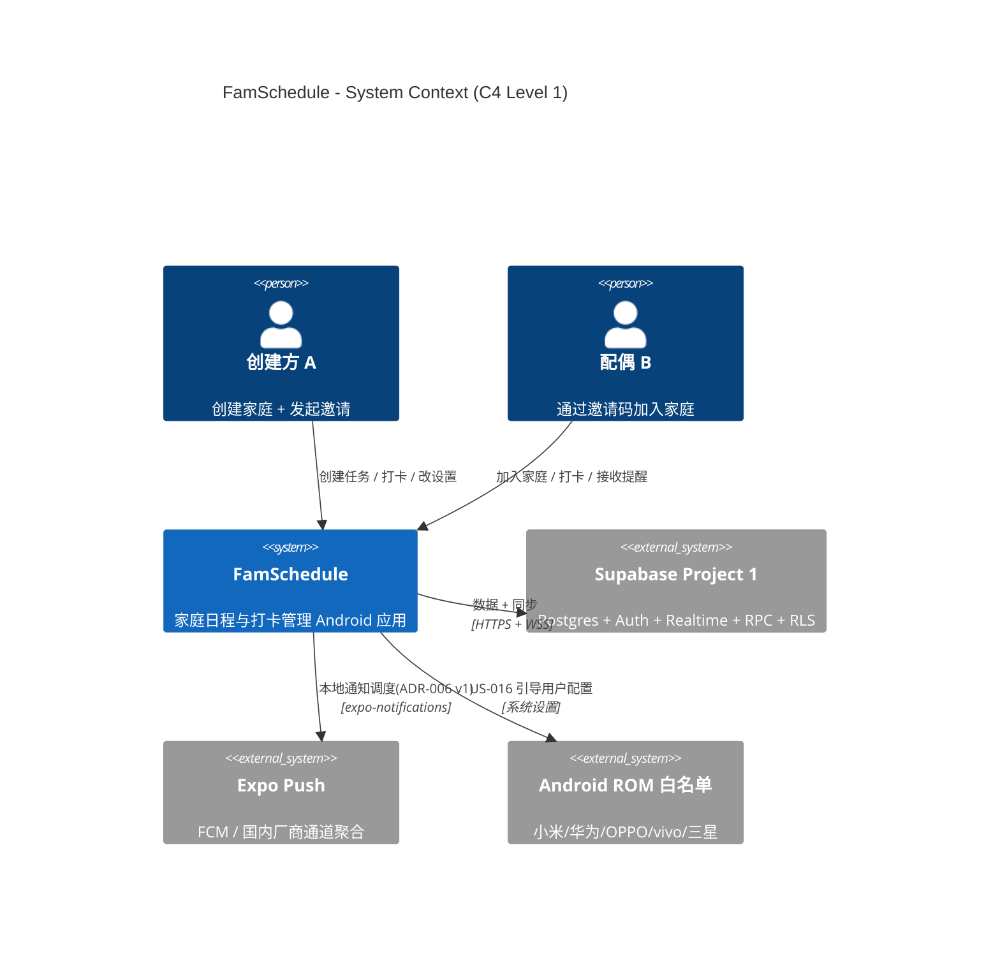
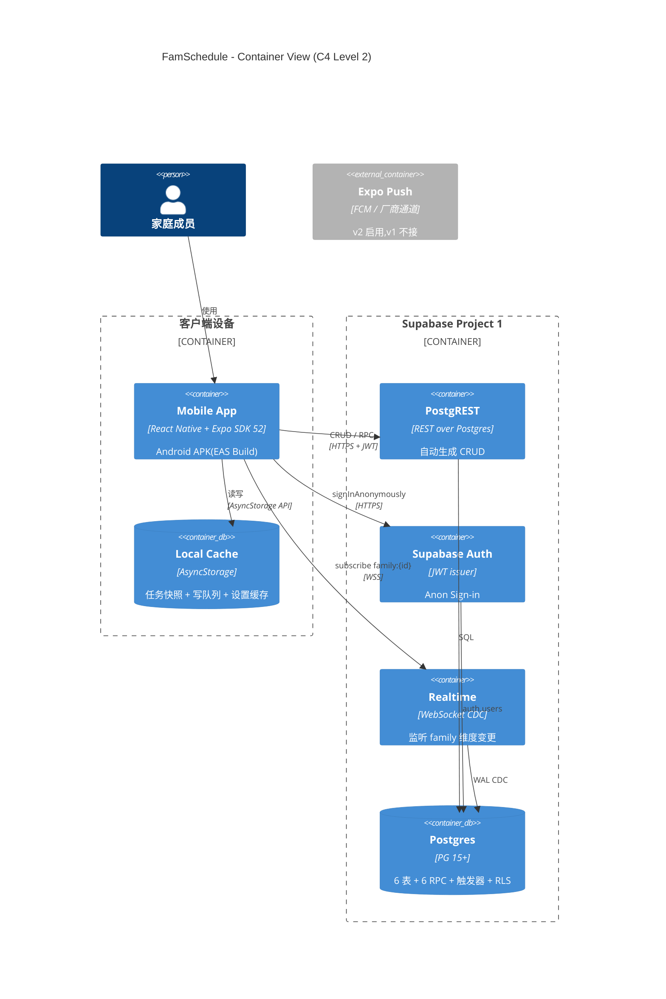
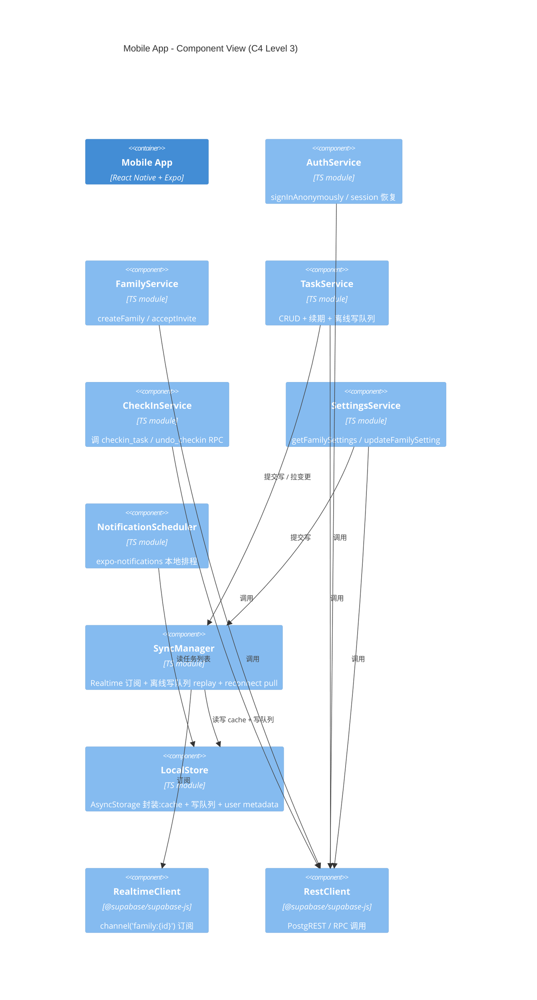
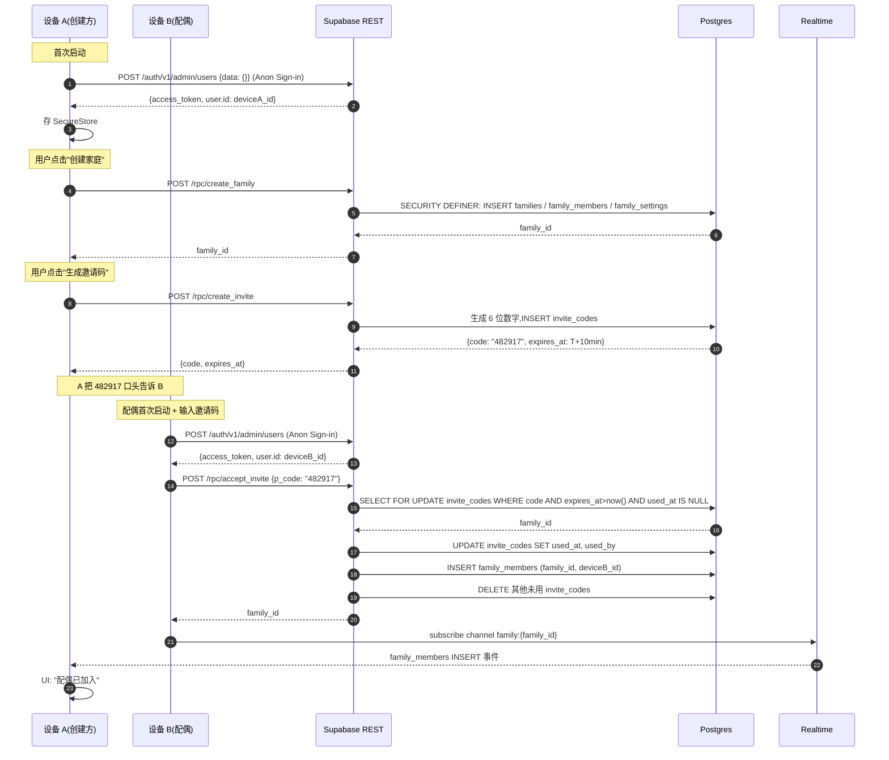
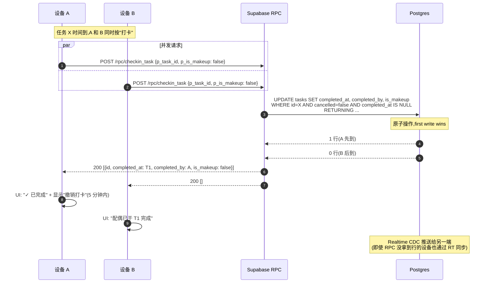
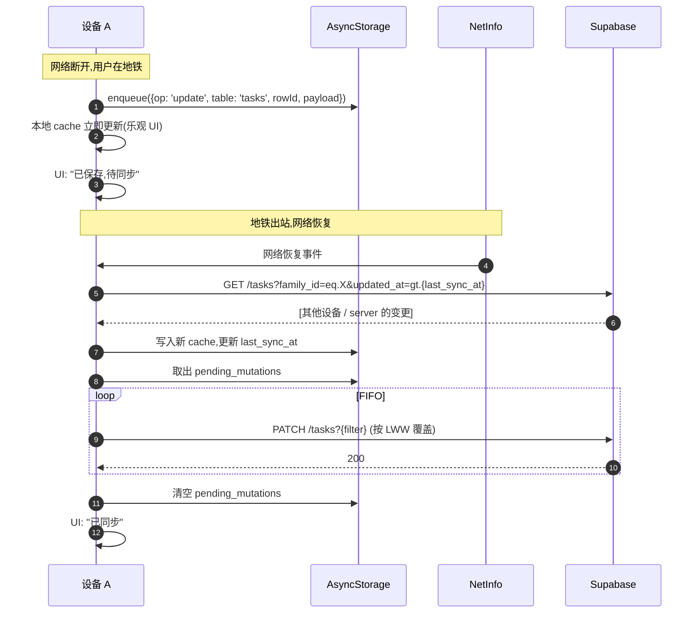
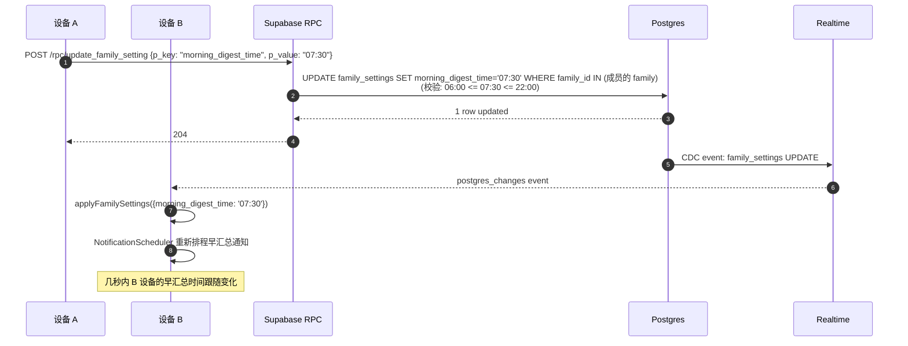
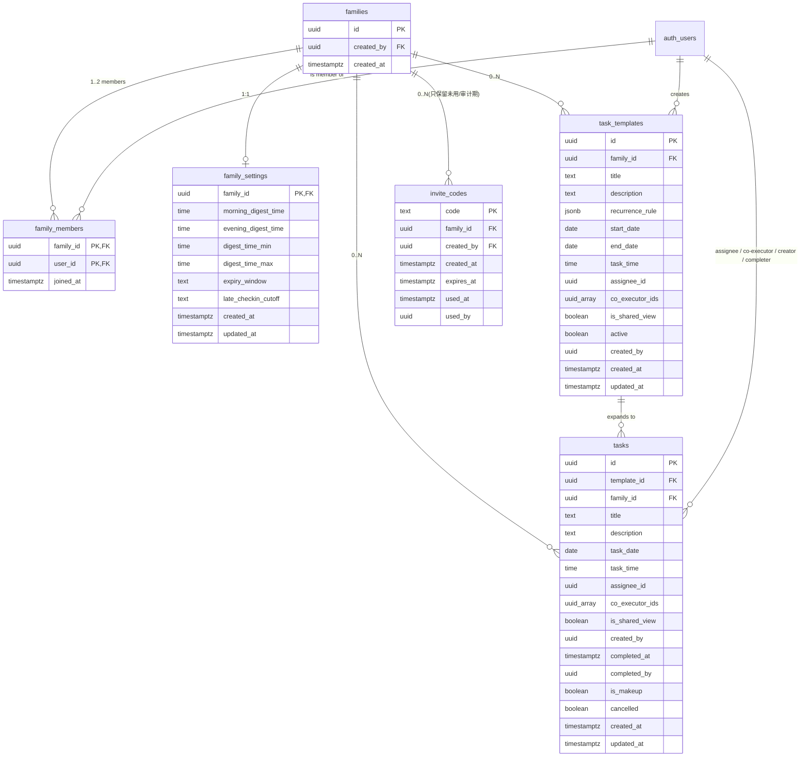

# FamSchedule — 架构文档 v1.0

> 家庭日程与打卡管理 Android 应用 · 主架构叙事

---

## 文档元信息

| 字段 | 值 |
|---|---|
| 项目名称 | FamSchedule |
| 文档版本 | v1.0(baseline)+ 后续修复 |
| 创建日期 | 2026-09-10 |
| **状态** | **✅ Approved(基线)+ 后续修复已整合** |
| 作者 | tech-lead |
| 来源 PRD | v1.3(Approved) |
| 关联 ADRs | adr-001 ~ adr-007 |
| 关联交付物 | `db-v1.1.sql`(修正后) / `api-v1.0.yaml` / `task-breakdown-v1.0.md` |
| 最近更新 | 2026-09-11 — 整合 T-SETUP-1 部署后发现的 3 个生产阻塞 bug,新增 §10 RLS 编写规则 + §11 后续修复 |

---

## ChangeLog

| 版本 | 日期 | 作者 | 变更摘要 | 影响的章节 + ADRs |
|---|---|---|---|---|
| v1.0 | 2026-09-10 | tech-lead | 初版基线,基于 PRD v1.3 + 7 个 ADR 全部 Accepted | 全部章节;ADR-001~007 |
| v1.0+fixes | 2026-09-11 | tech-lead | **db-v1.0.sql → db-v1.1.sql**:(1) RLS 无限递归修复,新增 `public.my_family_ids()` SECURITY DEFINER 函数 + 11 个 family-scoped RLS policy 改用此函数;(2) `checkin_task` / `undo_checkin` 用 `UPDATE public.tasks AS t` + `t.` 前缀消除 PL/pgSQL RETURNS TABLE 同名列歧义;(3) CREATE TRIGGER 改用 `DO $$ ... pg_trigger ... $$` 包裹保证 idempotent。详见 §10 + §11。 | §5.2 / §7.1;ADR-002 |

---

## §1 系统总览(C4 Level 1)



**说明:**
- 两个 Person 实际是同一家庭的不同设备,共享同一 `family_id`
- Supabase 只有一个外部依赖;Expo Push 在 ADR-006 v1 阶段**不主动用**(只挂 client-side 调度),升级到 v2 才接
- ROM 白名单是"被引导对象",不是技术依赖

---

## §2 项目描述(One-pager)

### 是什么
一个**面向一对夫妻**(MVP 严格 2 人)的轻量 Android 应用,核心闭环是「创建任务 → 到点提醒 → 一键打卡 → 共同追踪」。无真实账号体系,首次启动自动获得匿名身份,通过邀请码配对成家庭。

### 给谁用
P1 — 夫妻发起方:产品建设者 + 首批用户;P2 — 配偶:被邀请加入,愿意配合使用。两人都用 Android 8.0+(Expo SDK 52 默认要求)。

### 为什么做
国内 Android 端家庭场景缺乏垂直产品:日历 app 缺打卡、习惯打卡 app 缺协作、待办 app 社交过重。借助 Expo + Expo Push,低成本快速验证家庭内部使用场景。

### 顶层约束
- **C1** 严格 2 人,无孩子 / 长辈账号
- **C2** 仅 APK 直装,不上应用市场
- **C3** 后端走 Supabase 免费档
- **C4** 观察期 2-3 个月(PRD G5 成功标准)
- **C5** 推送不保证 100% 到达(国内 Android 后台限制)

---

## §3 架构风格与决策依据

### 整体风格:**Serverful 单体 + 客户端单 app**

- **服务端**:Supabase 单项目托管全部能力(Postgres / Auth / Realtime / RPC),不拆微服务
- **客户端**:React Native + Expo 单 app,模块化但不拆 bundle
- **风格理由**:MVP 2 人规模,微服务 / 多 app 收益为零,运维成本纯亏

### 关键决策一览

| 维度 | 决策 | ADR |
|---|---|---|
| 后端 | Supabase(Plan A) | adr-001 |
| Auth | Anon Sign-in + RLS | adr-002 |
| 任务数据 | 预展开(60 天 / 实例每行) | adr-003 |
| 配对 | `invite_codes` 表 + 原子 join RPC | adr-004 |
| 同步 | Server 权威 + 行级 LWW + Check-in 幂等 | adr-005 |
| 推送 | 客户端本地调度 v1(可升级) | adr-006 |
| 设置 | 家庭共享 + 设备本地 混合 | adr-007 |

### 不做的事(MVP 边界)

- ❌ iOS 客户端(只 Android)
- ❌ 多家庭 / 跨家庭
- ❌ 任务评论 / 聊天
- ❌ 复杂统计 / 数据导出
- ❌ Edge Functions(全部业务逻辑用 Postgres RPC)
- ❌ 服务端推送触发(v1 走本地调度)

---

## §4 组件分解

### 4.1 容器视图(C4 Level 2)



### 4.2 客户端组件分解(C4 Level 3,Mobile App 内部)



**组件职责摘要:**

| 组件 | 职责 | 关键依赖 |
|---|---|---|
| AuthService | 启动时 signInAnonymously,SecureStore 存 token | expo-secure-store, supabase.auth |
| FamilyService | 创建/加入家庭的 RPC 调用 | supabase.rpc |
| TaskService | 任务 CRUD + 续期逻辑 + 写队列提交 | supabase, SyncManager |
| CheckInService | 调打卡 / 撤销 RPC,处理 0 行返回 | supabase.rpc |
| SettingsService | 家庭共享设置 + 设备本地 metadata | supabase.rpc, auth.updateUser |
| NotificationScheduler | 本地通知排程 / 取消 / 重排 | expo-notifications |
| SyncManager | Realtime 订阅 + 离线写队列 + reconnect reconcile | supabase.channel, AsyncStorage, NetInfo |
| LocalStore | AsyncStorage 封装,统一 key schema | @react-native-async-storage |

### 4.3 关键流程时序

#### 4.3.1 家庭邀请 + 加入(US-012)



#### 4.3.2 打卡并发(US-005 first-finisher)



#### 4.3.3 离线写 + 重连同步(ADR-005)



#### 4.3.4 设置变更 Realtime 同步(US-017,ADR-007)



---

## §5 数据架构

### 5.1 ER 图



### 5.2 关键设计原则

| 原则 | 体现 |
|---|---|
| 单一权威源 | Postgres(ADR-005):LWW 仲裁 + `updated_at` trigger 由 server 维护 |
| 数据快照冗余 | `tasks` 行存 template 字段快照(ADR-003):避免每次查询 JOIN,代价是编辑模板要级联更新 |
| RLS 默认全表 | 所有 6 张表 `ENABLE ROW LEVEL SECURITY`,policy 只放 family 成员读 |
| 业务逻辑集中在 RPC | `create_family` / `create_invite` / `accept_invite` / `checkin_task` / `undo_checkin` / `update_family_setting`(SECURITY DEFINER 旁路 RLS) |
| 软删除优先 | `task_templates.active`、`tasks.cancelled`:保留历史,支持审计 |
| 续期幂等 | `uq_tasks_template_date` 唯一约束(ADR-003):续期重复展开自动被 DB 拒绝 |

详细 SQL 见 `db-v1.1.sql`(685 行,含 6 表 + 7 RPC + 4 trigger 函数 + 10 索引 + 1 唯一约束 + 1 视图 + RLS 13 个)。v1.1 相对 v1.0 的修复见 §10、§11。

---

## §6 API 架构

### 6.1 风格
**REST over PostgREST + 业务 RPC**。无 GraphQL、无 gRPC。客户端用 `@supabase/supabase-js` 调用,无需手写 fetch。

### 6.2 端点分类

| 类别 | 端点 | 调用方式 |
|---|---|---|
| Auth | `/auth/v1/admin/users`、`/auth/v1/user` | supabase.auth.signInAnonymously / updateUser |
| Family | `/rpc/create_family`、`GET /family_members` | supabase.rpc / from |
| Invite | `/rpc/create_invite`、`/rpc/accept_invite`、`/invite_codes` | supabase.rpc / from |
| Task | `/tasks`(CRUD)、`/family_shared_tasks` | supabase.from |
| TaskTemplate | `/task_templates`(CRUD) | supabase.from |
| CheckIn | `/rpc/checkin_task`、`/rpc/undo_checkin` | supabase.rpc(强制走 RPC) |
| Settings | `GET /family_settings`、`/rpc/update_family_setting` | supabase.rpc / from |

### 6.3 强制走 RPC 的写

下列写**禁止**直接 PATCH 表,必须走 RPC:
- 创建 / 撤销打卡(US-005、US-006):走 `checkin_task` / `undo_checkin` — 集中幂等 + 截止校验 + 5 分钟窗口
- 创建邀请码(US-012):走 `create_invite` — 集中碰撞重试 + 过期
- 加入家庭(US-012):走 `accept_invite` — 原子 check + mark + insert
- 更新家庭设置(US-017):走 `update_family_setting` — 集中时段范围校验

### 6.4 Realtime 订阅清单

`db-v1.0.sql` §8 已发布到 `supabase_realtime` publication:

| 表 | 监听事件 | 客户端处理 |
|---|---|---|
| `tasks` | INSERT/UPDATE/DELETE | 增量更新本地 cache,触发 UI 刷新 |
| `task_templates` | INSERT/UPDATE/DELETE | 同上,影响续期判断 |
| `family_settings` | UPDATE | applyFamilySettings,触发通知重排 |
| `family_members` | INSERT | "配偶已加入"提示 |

详细 OpenAPI 规范见 `api-v1.0.yaml`(778 行,覆盖 17 US 派生的全部端点)。

---

## §7 横切关注点

### 7.1 认证 / 授权

- **认证**:Supabase Anon Sign-in,所有调用带 `apikey` + `Authorization: Bearer <jwt>`(ADR-002)
- **授权**:Postgres RLS,每个 SELECT policy 走 `family_id IN (SELECT public.my_family_ids())`(v1.1 起统一通过 SECURITY DEFINER 函数间接读 family_members,**严禁**直接内联 `SELECT FROM family_members` 子查询 — 详见 §10 RLS 编写规则 #1)
- **写操作**:全部 RPC 是 SECURITY DEFINER,绕过 RLS;写逻辑内显式 `auth.uid()` 校验调用者

### 7.2 错误处理

| 错误类型 | 客户端处理 |
|---|---|
| 网络断开 | 写入 AsyncStorage 队列,UI 显示"待同步",reconnect 后 replay |
| 401(token 失效) | 清 SecureStore,重新 signInAnonymously,提示用户重新配对 |
| RPC 业务错误(RAISE EXCEPTION) | 解析 message 字符串(见 `db-v1.1.sql` §4 各 RPC),映射到友好提示 |
| 4xx 权限错误 | 几乎不发生(RLS 兜底),UI 显示通用错误 |
| 5xx 服务端错误 | 重试 1 次,失败后提示"网络异常,请稍后再试" |

### 7.3 可观测性

MVP 阶段**不引入 Sentry / DataDog**,理由:
- 2 人 app,日志量可忽略
- 引入第三方需评估国内网络 + 隐私合规
- 开发期 `console.log` + adb logcat 够用

**基础观测手段:**
- 客户端:`expo-error-reporter`(Expo 自带)收集 JS 异常,可在 EAS Dashboard 查
- 服务端:Supabase Dashboard 的 Logs 面板(Postgres log / API log / Auth log)
- 用户反馈:US-017「联系反馈」入口(PRD Q14 待定 — 工程阶段决定邮箱/微信群/GitHub issue)

### 7.4 部署 / 分发

- **APK 构建**:EAS Build(`eas build -p android --profile preview`)
- **分发**:不应用市场,内测 / 家庭试用通过 EAS 内部分发链接 / 二维码 / 微信传文件
- **版本管理**:EAS Build 自动递增 build number;semantic version 在 `app.json` 的 `version` 字段手动维护(初始 1.0.0)
- **OTA 更新**:不用(APK 重装,改动大才更新)

### 7.5 性能 / 容量

- **任务数据**:5 年 ~12,775 行,500KB 量级,远低于 Supabase 0.5GB 免费档
- **流量**:2 人每日 < 100 个 API 调用,远低于 5GB/月免费档
- **Realtime 连接**:2 个 device 长期连接,Supabase Realtime 免费档支持 200 并发连接,远低于

### 7.6 国际化 / 时区

- UI 文案:仅中文(PRD v1.3)
- 时区:按设备本地时区(ADR-006 v1);跨国旅行场景 ADR-006 已记为 v2 开放问题
- 时间格式:24 小时制

---

## §8 风险与开放问题

### 8.1 技术风险

| 风险 | 等级 | 缓解 / 应对 |
|---|---|---|
| 推送漏响率高(国产 ROM 后台) | 🟠 高 | ADR-006 v1 接受;US-016 引导加白名单;统计漏响率后评估升级到 v2 服务端 |
| Supabase 海外节点延迟 | 🟡 中 | MVP 不在意;P1 阶段若做实时性敏感功能需重新评估 |
| 离线写队列 app 强杀时丢失 | 🟡 中 | MVP 接受(PRD A2 联网假设);P1 可升级到 SQLite 持久化 |
| Supabase 账号被回收(ToS 灰区) | 🟡 中 | 每周检查 Project 1 状态;若被警告,迁移到新账号(备份数据) |
| Expo Push 服务故障 | 🟢 低 | ADR-006 v1 不用 Expo Push,v2 才依赖 |

### 8.2 开放问题(从 PRD 继承 + tech-lead 补充)

| # | 问题 | 决策时机 | 备注 |
|---|---|---|---|
| Q1 | 任务是否需要分类标签(M8)? | P1 | PRD 开放问题 |
| Q2 | 任务评论/聊天(M10)? | P1 | PRD 开放问题 |
| Q3 | 周期规则更复杂(每月最后工作日)? | P1 | PRD 开放问题 |
| Q4 | 同一家庭超过 2 个成员? | P2 | PRD 开放问题,需重构 family_members cap trigger |
| Q5 | 孩子/长辈账号? | P2 | PRD 开放问题 |
| Q6 | 数据导出 / 高级报表? | P2 | PRD 开放问题 |
| Q10 | 后端 BaaS 选型 | ✅ | 本设计锁定 Supabase(ADR-001) |
| Q11 | 重置身份并恢复原家庭? | P1 | PRD 开放问题;creator 卸载后无法回归是已知 UX 痛点 |
| Q13 | 冷启动拉取漏推? | v2 推送升级时 | ADR-006 关联 |
| Q14 | 设置页"联系反馈"渠道? | 工程阶段 | 建议:微信群 / 邮箱二选一 |
| Q15 | 早/晚汇总时间精确度? | 工程阶段 | 当前支持任意 TIME,UI 提供 time picker |
| **T-NEW-1** | family_members 没有"role"字段,creator / joiner 区分靠 joined_at;后续如需不同权限如何处理? | P1 | 当前 MVP 不需要;若要做"退出家庭"功能则需重构 |
| **T-NEW-2** | 任务补卡截止逻辑是"按 task_date 与 now() 比较",用户改设备时间可以绕过 | 永不修复 | MVP 接受;P1 可加 server-only time check |
| **T-NEW-3** | 软删除的 task_templates / cancelled tasks 长期累积是否需要清理? | 6 个月后观察 | 当前 < 12K 行,容量无压力 |

### 8.3 已锁定决策清单(防回退)

| 决策 | 来源 | 备注 |
|---|---|---|
| Supabase 免费档 + 1 生产 + 1 备用 | ADR-001 | 备用位不可挪用 |
| Anon Sign-in 不引入手机号/邮箱 | ADR-002 | 符合 PRD US-013 |
| 任务实例 60 天窗口 + 客户端续期 | ADR-003 | 不用 Edge Function cron |
| 邀请码 6 位数字 + 10 分钟 + DB 存 row | ADR-004 | 不用 HMAC |
| 行级 LWW + check-in 幂等 | ADR-005 | 不上 CRDT |
| 推送 v1 客户端本地调度 | ADR-006 | v2 升级条件已记 |
| 家庭共享 + 设备本地 混合 | ADR-007 | 不放全云 / 不放全本地 |

---

## §9 关联文档与参考

### 9.1 项目内文档

| 路径 | 内容 |
|---|---|
| `../req/prd-v1.3.md` | 产品需求文档(Approved) |
| `notes-prd-summary.md` | PRD 理解摘要 + 决策日志 |
| `adr-001-supabase-backend.md` | 后端 = Supabase |
| `adr-002-anon-signin-auth.md` | Auth = Anon Sign-in + RLS |
| `adr-003-recurring-task-expansion.md` | 任务预展开 |
| `adr-004-invite-codes-db-row.md` | 邀请码 + 原子 join |
| `adr-005-sync-conflict-lww.md` | 同步 + 冲突 |
| `adr-006-client-side-push.md` | 推送 v1(可升级) |
| `adr-007-settings-hybrid.md` | 设置混合 |
| `db-v1.0.sql` | 数据库 schema **历史版本**(有 3 个生产阻塞 bug,详见 §11) |
| `db-v1.1.sql` | 数据库 schema **当前 source-of-truth**(已整合全部 3 个 fix,新增 §10 规则) |
| `api-v1.0.yaml` | OpenAPI 3.1 规范 |
| `task-breakdown-v1.0.md` | 17 US 拆解的开发任务 |

### 9.2 外部参考

- Supabase 文档:https://supabase.com/docs
- Expo 文档:https://docs.expo.dev
- Expo Notifications:https://docs.expo.dev/versions/latest/sdk/notifications
- C4 Model:https://c4model.com
- Mermaid:https://mermaid.js.org

### 9.3 关键 PRD 引用

- §1.2 机会:"低成本快速验证"
- §5 非功能需求:目标平台 / 技术栈 / 推送通道 / 分发方式
- §6.1 约束:C1-C5
- §6.2 假设:A1-A6
- §7 开放问题:Q1-Q15
- §8 交接清单:5 项(US-013 + US-012 优先)

---

## §10 RLS 编写规则(2026-09-11 tech-lead 补)

> 这两条规则来自 T-SETUP-1 部署过程中实际踩到的 3 个生产阻塞 bug 的根因分析。v1.0 提交时未识别,T-SETUP-1 部署后由 backend-dev 复现并修复。后续任何 RLS policy / 业务 RPC 函数都必须遵守。

### 规则 #1:RLS policy 严禁内嵌 self-table 子查询;统一通过 SECURITY DEFINER 函数间接读取。

**严禁写法**(v1.0 全表 13 个 policy 全部中招):

```sql
-- ❌ 不要这样写
CREATE POLICY tasks_select ON public.tasks
  FOR SELECT USING (
    family_id IN (SELECT family_id FROM public.family_members WHERE user_id = auth.uid())
  );
```

**根因**:`family_members` 表自身也启用了 RLS,其 SELECT policy 与其它 policy 写**完全一样**。当 Postgres 评估 `tasks` 的 USING 子句时,会尝试读 `family_members`;一旦它执行了 `family_members` 的 SELECT,就会再次触发 `family_members_select` policy,policy 又要读 `family_members` → **无限递归**,数据库抛 `infinite recursion detected in policy` 错误,所有 family-scoped 查询 100% 失败。

**正确写法**(v1.1 起):

```sql
-- ✅ 通过 SECURITY DEFINER 函数绕开 RLS 自查询
CREATE POLICY tasks_select ON public.tasks
  FOR SELECT USING (
    family_id IN (SELECT public.my_family_ids())
  );
```

`public.my_family_ids()` 函数定义如下(见 `db-v1.1.sql` §2):

```sql
CREATE OR REPLACE FUNCTION public.my_family_ids()
RETURNS SETOF UUID
LANGUAGE sql
STABLE
SECURITY DEFINER     -- 关键:让函数以 owner 权限执行,绕过 RLS
SET search_path = public
AS $$
  SELECT family_id FROM public.family_members WHERE user_id = auth.uid();
$$;
```

**为什么用 `SECURITY DEFINER` + `STABLE` 而不是 `SECURITY INVOKER`**:
- `SECURITY DEFINER` 以函数 owner 身份执行,owner 通常是 `postgres`,对所有表有完整访问权,直接绕过 RLS → 不会触发递归。
- `STABLE` 告诉优化器同一次查询中函数返回结果不变,允许 planner 把它 inline 或缓存,避免每行重新调用。
- `SET search_path = public` 防止 search_path 攻击(恶意用户改 path 指向自己建的同义词表)。

**附带收益**:`my_family_ids()` 在 `auth.uid() IS NULL` 时返回空集,所有调用它的 RLS USING 表达式自动评估为 false,等价于 anon 角色 0 行可见 — **无需额外为 anon 写 deny policy**(`verify.sql` v10 检查 `pg_policies WHERE roles @> ['anon'] AND cmd='SELECT' = 0`)。

**新增 family-scoped 表时**:在写第一条 RLS policy 之前,**先**在 `db-v1.1.sql` §2 区域确认 `my_family_ids()` 已存在,然后所有 USING / WITH CHECK 子句一律调用它。**不要**写内联子查询,不管多"简单"。

### 规则 #2:RETURNS TABLE 同名列名函数体必须用表别名 `AS t` 消除 PL/pgSQL 歧义。

**严禁写法**(v1.0 的 `checkin_task` / `undo_checkin` 全部中招):

```sql
-- ❌ 函数能 CREATE,但首次 CALL 必崩 "column reference 'id' is ambiguous"
CREATE OR REPLACE FUNCTION public.checkin_task(
  p_task_id UUID, p_is_makeup BOOLEAN DEFAULT false
) RETURNS TABLE (id UUID, completed_at TIMESTAMPTZ, completed_by UUID, is_makeup BOOLEAN)
LANGUAGE plpgsql SECURITY DEFINER AS $$
BEGIN
  RETURN QUERY
    UPDATE public.tasks
    SET completed_at = now(), completed_by = v_caller, is_makeup = p_is_makeup
    WHERE id = p_task_id                -- ❌ 'id' 歧义:是 RETURNS TABLE.id 还是 public.tasks.id?
      AND cancelled = false             -- ❌ 'cancelled' 同理
      AND completed_at IS NULL          -- ❌ 'completed_at' 同理
      AND (NOT p_is_makeup OR public.is_makeup_allowed(id, v_caller))
    RETURNING tasks.id, tasks.completed_at, tasks.completed_by, tasks.is_makeup;
END;
$$;
```

**根因**:PL/pgSQL 的 `RETURNS TABLE` 会创建隐式 OUT 参数(等价于函数局部变量),变量名与列名同名时,任何裸列引用(不写 `表.` 前缀)会被解析为变量,而不是表列。`SET` 子句里的列名解析顺序尤其狡猾 — 函数能 CREATE(CREATE 时不做解析),但首次 CALL 时 planner 才发现歧义 → 崩。

**为什么 v1.0 的 verify 没抓到**:`verify.sql` 的 10 项全是结构性检查(表数 / policy 数 / 函数数),**没有**实际调用 `checkin_task` 或 `undo_checkin` RPC。T-SETUP-1 部署时 backend-dev 跑了真实 RPC 才暴露。

**正确写法**(v1.1 起):

```sql
-- ✅ UPDATE 显式 `AS t` 别名 + 所有列加 `t.` 前缀,无歧义
CREATE OR REPLACE FUNCTION public.checkin_task(
  p_task_id UUID, p_is_makeup BOOLEAN DEFAULT false
) RETURNS TABLE (id UUID, completed_at TIMESTAMPTZ, completed_by UUID, is_makeup BOOLEAN)
LANGUAGE plpgsql SECURITY DEFINER AS $$
DECLARE
  v_caller UUID := auth.uid();
BEGIN
  IF v_caller IS NULL THEN RAISE EXCEPTION 'Not authenticated'; END IF;

  RETURN QUERY
    UPDATE public.tasks AS t            -- ✅ 显式别名
    SET t.completed_at = now(),         -- ✅ t. 前缀
        t.completed_by = v_caller,
        t.is_makeup = p_is_makeup
    WHERE t.id = p_task_id              -- ✅
      AND t.cancelled = false
      AND t.completed_at IS NULL
      AND (NOT p_is_makeup OR public.is_makeup_allowed(t.id, v_caller))
    RETURNING t.id, t.completed_at, t.completed_by, t.is_makeup;
END;
$$;
```

**经验法则**:
- RETURNS TABLE 函数体里**任何**对业务表的列引用都加表别名;`SET`、`WHERE`、`RETURNING`、`INSERT ... ON CONFLICT ... UPDATE` 同理。
- 防御性收益:即使未来 RETURNS TABLE 列表加新列与表同义,也不需要回头改函数体。
- `undo_checkin` v1.0 原始版本能跑通只是因为巧合(RETURNS TABLE 列表中 `id` / `completed_at` / `completed_by` 三个列,虽然同名但 WHERE 子句没歧义),v1.1 仍然统一加 `t.` 前缀,作为"防回归"模板。

### 验证清单(任何新 RLS policy / 业务 RPC 上线前自检)

- [ ] 该 RLS policy 的 USING / WITH CHECK 子句**没有**直接 `SELECT FROM <本表>` 或 `SELECT FROM <其他受 RLS 保护的表>`(如 `family_members`),而是调用 `my_family_ids()` 之类的 SECURITY DEFINER 函数。
- [ ] 业务 RPC 函数声明了 `RETURNS TABLE` 且函数体里 UPDATE/INSERT 业务表 → 使用 `AS t` 别名 + `t.` 前缀。
- [ ] RPC 函数 CREATE 之后,本地起一个测试会话,**实际**调用 RPC 一次(不是只 verify 存在性),确认能跑通。
- [ ] `verify.sql` v10 检查通过:`pg_policies WHERE roles @> ['anon'] AND cmd='SELECT' = 0`(确认没有给 anon 写 SELECT policy,且没有别的方式让 anon 能 SELECT family-scoped 数据)。

---

## §11 后续修复(v1.0 → v1.1)

> 这一节登记 v1.0 基线交付后,在 T-SETUP-1(Supabase 部署)阶段被 backend-dev 复现并修复的 3 个生产阻塞 bug。这些 fix 已合并到 `db-v1.1.sql` 作为新 source-of-truth;`db-v1.0.sql` 保留为历史版本,不再用于新部署。

### 11.1 RLS 无限递归(v1.0 → v1.1 fix)

| 维度 | 内容 |
|---|---|
| **严重度** | 🔴 Critical — 任何 family-scoped SELECT 全部崩溃,生产不可用 |
| **根因** | 所有 13 个 family-scoped RLS policy 内嵌 `SELECT family_id FROM public.family_members WHERE user_id = auth.uid()`,`family_members` 自身 RLS SELECT policy 与之同形,触发无限递归 |
| **错误信息** | `infinite recursion detected in policy for relation "family_members"` |
| **修复** | 新增 `public.my_family_ids()` SECURITY DEFINER STABLE 函数,所有 13 个 RLS policy 的 USING / WITH CHECK 改用 `family_id IN (SELECT public.my_family_ids())` |
| **为何不"删 family_members RLS"** | family_members 必须有 SELECT policy(否则用户看不到自己所在家庭 + 配偶信息)。SECURITY DEFINER 函数是唯一干净解。 |
| **修复成本** | 1 个新函数(~8 行)+ 13 个 policy 各改 1 行,共 ~20 行 |
| **教训** | 任何 RLS-protected 表的 SELECT policy 中,只要引用了其他 RLS-protected 表(尤其是"自表"),就必须走 SECURITY DEFINER 函数 |

### 11.2 checkin_task 同名列歧义

| 维度 | 内容 |
|---|---|
| **严重度** | 🟠 High — 打卡 RPC 不可用,US-005 整条用户故事阻塞 |
| **根因** | 函数体里 `WHERE id = p_task_id` / `SET completed_at = ...` 等裸列名,与 RETURNS TABLE 的同名 OUT 参数在 PL/pgSQL 解析时歧义 |
| **错误信息** | `column reference "id" is ambiguous` |
| **修复** | `UPDATE public.tasks AS t SET t.completed_at = ...` + 所有 tasks 列加 `t.` 前缀 |
| **修复成本** | 1 个函数体,~8 行改动 |
| **教训** | RETURNS TABLE 函数体的 SET/WHERE/RETURNING 永远带表别名;verify.sql 必须实际调用 RPC 不能只看定义存在性 |

### 11.3 undo_checkin 同名列歧义(防御性)

| 维度 | 内容 |
|---|---|
| **严重度** | 🟡 Medium — 未被任何 verify 触发,生产一旦调用必崩 |
| **根因** | 同 11.2,但 RETURNS TABLE 列名子集与表列名部分重叠,原始写法因"刚好"无歧义而未崩。仍按规则 #2 一致性应用别名 |
| **修复** | 同 11.2 |
| **修复成本** | 同 11.2 |
| **教训** | 不要依赖"刚好不崩"作为安全性;命名约定一致性 > 局部省事 |

### 11.4 整合后的状态

| 文件 / 制品 | 状态 |
|---|---|
| `db-v1.0.sql` | 🔒 冻结,作为历史基线保留(对照、追溯) |
| `db-v1.1.sql` | ✅ **新 source-of-truth**;fresh deploy 应当使用此文件 |
| `supabase/migrations/20250911000000_init.sql` | 保留(部署历史 init migration,与 v1.0 字节级一致) |
| `supabase/migrations/20250911010000_fix_rls_recursion.sql` | 保留(部署历史 fix 1,生产 DB 已应用) |
| `supabase/migrations/20250911020000_fix_checkin_id_ambiguity.sql` | 保留(部署历史 fix 2,生产 DB 已应用) |
| `supabase/migrations/20250911030000_fix_undo_checkin_id_ambiguity.sql` | 保留(部署历史 fix 3,生产 DB 已应用) |
| `arch-v1.0.md` §10 / §11 | 本节,登记规则与修复 |
| `task-breakdown-v1.0.md` T-SETUP-1.1 | 合并 fix 任务记录 |

### 11.5 顺手扫到的其他潜在问题(只报告,不修)

> 阅读 v1.0 SQL 时发现的疑似隐患,本任务范围外,记在这里供后续评估。

1. **`create_invite` / `accept_invite` / `update_family_setting` 内部 `SELECT family_id FROM public.family_members`** — 这三个 RPC 都是 `SECURITY DEFINER`,以 owner 身份跑,不走调用者的 RLS,**不会**触发递归。但风格上仍可考虑统一用 `my_family_ids()`,作为"读 family_members 永远走 helper 函数"的统一约定。
2. **`enforce_family_member_cap` trigger 函数内部 `SELECT COUNT(*) FROM public.family_members`** — 同样是 SECURITY DEFINER 触发器函数,不会触发 RLS,无 bug,但风格同上。
3. **`create_invite` 的 6 位数字邀请码** — 当前用 `loop + EXCEPTION WHEN unique_violation` 碰撞重试,理论上 6 位空间 1M,5 次重试兜底可能不够(假设有 1000 个未用邀请码,冲突概率 ~0.1%,基本够用)。低优先级。
4. **`is_makeup_allowed` 截止逻辑** — 用 `task_date` 与 `now() - interval '1 day'::DATE` 比较,**用户改设备时间可绕过**(arch-v1.0 §8 T-NEW-2 已记,本次不修)。
5. **`auth.uid()` 在 RLS 上下文中的 NULL 处理** — 严格说,RLS 评估时调用者未登录(`auth.uid() IS NULL`),`my_family_ids()` 返回空集,USING 永远 false,行不可见。这与 verify v10 的 "no anon SELECT policies" 一致。**但** Supabase 的 anon role 默认在 JWT 验证通过前 `auth.uid()` 一定为 NULL,所以这个保护是足够的。
6. **未发现其他 RETURNS TABLE 函数有同样的 `AS t` 缺失问题** — `create_invite` 是 RETURNS TABLE,但函数体里没有 UPDATE/INSERT,只有 INSERT + RETURN QUERY,不存在同名列歧义。`create_family` / `accept_invite` / `update_family_setting` 是 `RETURNS UUID` / `RETURNS VOID`,不受规则 #2 约束。

---

**文档基线 v1.0 + 后续修复 · 2026-09-11 · ✅ Approved-by-Zzshark + ✅ fixes-integrated**
