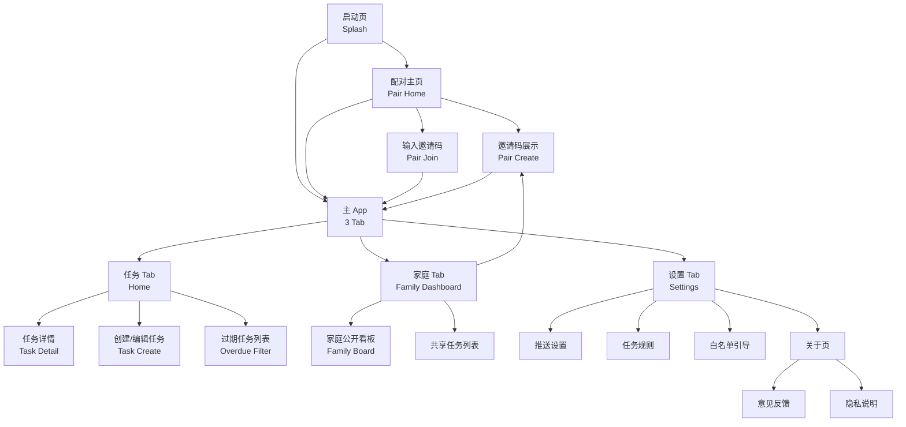

# FamSchedule — UI/UX 设计规范 v1.0

> 家庭日程与打卡管理 Android 应用 · 主设计 spec(设计系统 + 决策记录)

---

## 文档元信息

| 字段 | 值 |
|---|---|
| 项目名称 | FamSchedule |
| 文档版本 | v1.0 |
| 创建日期 | 2026-09-10 |
| **状态** | **✅ Approved(初版基线)** |
| 作者 | UI/UX Designer Agent |
| 来源 PRD | v1.3(Approved) |
| 来源架构 | arch-v1.0.md(Approved) + ADR-001~007 |
| 目标平台 | Android 8.0+ (React Native + Expo SDK 52) |
| UI 库 | **Tamagui** + 自定义 token(主) |
| 图标库 | **Phosphor Icons**(`@phosphor-icons/react-native`) |
| 字体 | **思源黑体 / Noto Sans CJK SC**(自打包 3 字重) |
| 字号阶梯 | 温暖家庭版(display 36 / title 22 / heading 17 / body 15 / meta 13 / micro 11) |

---

## ChangeLog

| 版本 | 日期 | 作者 | 变更摘要 | 影响章节 |
|---|---|---|---|---|
| v1.0 | 2026-09-10 | UI/UX Designer | 初版基线;7 项 Socratic 决策全部锁定;完整 design system + 9 屏幕规格 | 全部 |

---

## 进度概览

### 屏幕状态

| 状态 | 数量 | 屏幕清单 |
|---|---|---|
| ✅ Done(已完成) | 9 | splash, pair-home, pair-create, pair-join, home, task-detail, task-create, family-dashboard, settings |
| 🟡 In Progress | 0 | — |
| ⚪ Not Started | 0 | — |
| 🔴 Blocked | 0 | — |
| **合计** | **9** | — |

### 流程图状态

| 状态 | 数量 | 流程清单 |
|---|---|---|
| ✅ Done | 5 | 邀请配对、打卡并发、设置同步、推送调度、过期 banner |
| **合计** | **5** | — |

---

## 0. 设计决策记录(Design Decision Log)

> 这些是 Socratic 探索阶段的关键决策。每条都包含背景、决策、备选、理由。后续迭代时,决策可演进,但必须在此处追加记录。

### DD-001 视觉风格 + UI 库
- **决策**:**暖色家庭感 + Tamagui**(备选 NativeBase,但 Tamagui token 体系更灵活)
- **理由**:FamSchedule 差异化在于"为家庭内部设计"而非"效率工具",Material You 太通用,极简风太冷,国产主流太"工具"。Tamagui 编译时 token 让后续改色/改密度都很快。
- **影响**:全 design system、所有屏幕

### DD-002 色板
- **决策**:**方向 ④ 南瓜赤陶变体 b**(`#DC5A24`)+ 亚麻 `#F4ECDC` + 灰蓝配偶色 `#5B7A8C`
- **关键数据**:Primary 在白底对比度 4.55:1 ✅(过 WCAG AA 正文);在奶油底对比度 3.35:1 ✅(大字/UI 控件)
- **Identity A(我)**=`primary`;**Identity B(配偶)**=`#5B7A8C` 灰蓝(冷色配偶,避免两人都用暖色单调)
- **影响**:design-v1.0 §1.1、所有屏幕

### DD-003 字体
- **决策**:**思源黑体 / Noto Sans CJK SC** 自打包 + 3 字重(Regular / Medium / Semibold)+ 温暖家庭版字号阶梯
- **字号**:`display 36 / title 22 / heading 17 / body 15 / meta 13 / micro 11`,行高统一 1.5
- **理由**:用户优先 APK 体积(~3MB);思源黑体中性专业,暖色卡片+圆角+软阴影仍能撑住"家庭"温度
- **影响**:design-v1.0 §1.2、所有屏幕文字

### DD-004 首页布局
- **决策**:**风格 1「家庭日历」型**
- **结构**:顶部大日期+早安文案+头像+右上+按钮 → 过期 banner(N=0 消失)→ segmented tab[今天/本周/全部]→ 卡片式任务 → 底部 3 tab
- **理由**:与暖色色板+思源字体同源;卡片式任务让打卡按钮有视觉权重;过期 banner 位置显眼但不挤占主列表
- **影响**:home screen 详细规格

### DD-005 底部 Tab Bar
- **决策**:**任务/家庭/设置 等宽 3 tab** + Phosphor Icons + 赤陶激活色 + 4px 圆点指示器 + 底部 12px 安全区
- **顺序**:任务(左,使用 80%+)→ 家庭(中)→ 设置(右)
- **不凸起**:3 tab 模式凸起会显挤,Family 关系核心用"内容"而不是"位置"表达
- **影响**:所有底部 tab、所有屏幕底部

### DD-006 状态范式
- **决策**:四态分级(空/加载/错误/离线)
- **空状态**:插画 + 文案 + 主按钮;6-8 个简单几何 SVG,赤陶+灰蓝双色
- **加载**:首次内容用骨架屏;操作反馈用内联 spinner;下拉用顶部小条;**打卡用乐观 UI**
- **错误**:三档分级 — 阻塞用居中占位、非阻塞用顶部 banner+toast、轻提示用底部 toast
- **离线**:顶部 16-24px 琥珀色细条 + 待同步小图标
- **影响**:横切所有屏幕

### DD-007 暗色模式 + 启动 + 反馈 + 图标 + 引导
- **暗色**:**v1 支持,跟随系统 + 应用内手动开关**(设置 → 显示 → 主题)
- **启动**:**Logo + 品牌名 + 标语**,无进度条(启动 < 1s)
- **反馈**:**应用内表单(主,存 Supabase `feedback` 表)+ 微信二维码(次,在关于页)**
- **应用图标**:**赤陶 `#DC5A24` 房子剪影 + 右上日历格子**,Android Adaptive Icon
- **首次启动**:**零引导**,直接进入"创建/加入家庭"二选一页面
- **影响**:splash screen、settings screen、关于页、app 图标资源

---

## 1. 设计系统(Design System)

### 1.1 颜色 Token

#### 亮色模式(Light)

| Token | HEX | HSL | 用途 |
|---|---|---|---|
| `--color-primary` | `#DC5A24` | 16° 76% 50% | 主品牌、操作按钮、激活态、Identity A(我) |
| `--color-on-primary` | `#FFFFFF` | — | Primary 之上的文字/icon |
| `--color-primary-hover` | `#C04E1E` | 16° 76% 43% | Primary 按钮 hover 态 |
| `--color-primary-pressed` | `#A8431A` | 16° 76% 38% | Primary 按钮 pressed 态 |
| `--color-background` | `#F4ECDC` | 35° 49% 91% | 全局背景(亚麻) |
| `--color-surface` | `#FFF9F0` | 33° 100% 97% | 卡片、Sheet、Dialog 背景 |
| `--color-surface-variant` | `#F0E5D0` | 35° 50% 87% | 略深于 surface,用于次级容器 |
| `--color-text-primary` | `#3A2E20` | 27° 33% 18% | 主要文字 |
| `--color-text-secondary` | `#7A6E5D` | 28° 14% 42% | 次要文字、说明 |
| `--color-text-tertiary` | `#A89B86` | 33° 17% 59% | 三级文字、placeholder |
| `--color-border` | `#E8DFD0` | 33° 33% 86% | 卡片边框、分隔线 |
| `--color-border-strong` | `#D0C5B0` | 33° 25% 75% | 强调边框 |

#### Identity 色(我 / 配偶)

| Token | HEX | 用途 |
|---|---|---|
| `--color-identity-a` | `#DC5A24` | "我"的色相(同 primary),用于我头像、我的任务归属 |
| `--color-identity-b` | `#5B7A8C` | 配偶色相(冷灰蓝),用于配偶头像、配偶任务归属 |
| `--color-identity-a-bg` | `#FBE8DD` | Identity A 浅色背景(标签) |
| `--color-identity-b-bg` | `#E1E8ED` | Identity B 浅色背景(标签) |

#### 语义色(Semantic)

| Token | HEX | 用途 |
|---|---|---|
| `--color-success` | `#5C9D7E` | 已完成、打卡成功 |
| `--color-success-bg` | `#E8F0EA` | 成功 banner 背景 |
| `--color-success-text` | `#2E5945` | 成功文字 |
| `--color-warning` | `#E0A341` | 过期、即将过期、离线 |
| `--color-warning-bg` | `#FBF1DC` | warning banner 背景 |
| `--color-warning-text` | `#7A5615` | warning 文字 |
| `--color-error` | `#C95444` | 失败、阻塞错误 |
| `--color-error-bg` | `#FBEAE7` | error banner 背景 |
| `--color-error-text` | `#7A2E25` | error 文字 |
| `--color-info` | `#5B7A8C` | 系统提示(同 identity-b) |
| `--color-info-bg` | `#E7EDF1` | info banner 背景 |
| `--color-info-text` | `#2E3F4A` | info 文字 |

#### 暗色模式(Dark)

| Token | 暗色 HEX | 亮色 HEX | 变化逻辑 |
|---|---|---|---|
| `--color-primary` | `#E26B3A` | `#DC5A24` | 略提亮以保对比 |
| `--color-on-primary` | `#FFFFFF` | `#FFFFFF` | 不变 |
| `--color-primary-hover` | `#F07B47` | `#C04E1E` | 提亮 |
| `--color-background` | `#1A1814` | `#F4ECDC` | 反色(深棕黑,非纯黑) |
| `--color-surface` | `#25221D` | `#FFF9F0` | 反色 |
| `--color-surface-variant` | `#2F2A23` | `#F0E5D0` | 略深于 surface |
| `--color-text-primary` | `#F4ECDC` | `#3A2E20` | 反色(亚麻,高对比但不刺眼) |
| `--color-text-secondary` | `#A89B86` | `#7A6E5D` | 反色 |
| `--color-text-tertiary` | `#6E6452` | `#A89B86` | 反色 |
| `--color-border` | `#3A332B` | `#E8DFD0` | 反色 |
| `--color-identity-a` | `#E26B3A` | `#DC5A24` | 提亮 |
| `--color-identity-b` | `#7B9AB0` | `#5B7A8C` | 提亮 |
| `--color-identity-a-bg` | `#3A2218` | `#FBE8DD` | 深色背景 |
| `--color-identity-b-bg` | `#1F2A33` | `#E1E8ED` | 深色背景 |
| 语义色(success/warning/error/info) | **保持不变** | 已锁定 | 信任色跨主题 |

> **关键设计:暗色不纯黑**(`#1A1814` 深棕黑),和"暖色家庭感"在暗色模式下也保持温度,不冷。

### 1.2 字体 Token

#### 字体家族

```css
--font-family-base: 'Noto Sans CJK SC', 'PingFang SC', 'Hiragino Sans GB', 'Microsoft YaHei', sans-serif;
--font-family-mono: 'JetBrains Mono', 'SF Mono', monospace;  /* 邀请码、打卡数等数字 */
--font-family-display: 'Noto Sans CJK SC', sans-serif;  /* 与 base 同,但显式语义 */
```

#### 字号阶梯(温暖家庭版)

| Token | px | 行高 | 字重建议 | 用途 |
|---|---|---|---|---|
| `--font-size-display` | 36 | 44(1.22) | Semibold | 邀请码 6 位数字、Splash 品牌名 |
| `--font-size-title` | 22 | 32(1.45) | Semibold | 页面标题 |
| `--font-size-heading` | 17 | 26(1.53) | Medium | 列表项主文字、卡片标题 |
| `--font-size-body` | 15 | 24(1.6) | Regular | 正文、按钮文字 |
| `--font-size-meta` | 13 | 20(1.54) | Regular | 时间戳、状态徽标、副文案 |
| `--font-size-micro` | 11 | 16(1.45) | Regular | 提示、版本号、法律 |

> **行高 1.5-1.6** 是中文阅读的最佳节奏,比英文所需的 1.4 略高。

#### 字重

| Token | 数值 | 用途 |
|---|---|---|
| `--font-weight-regular` | 400 | 正文、说明、时间戳 |
| `--font-weight-medium` | 500 | 列表项标题、强调、按钮文字 |
| `--font-weight-semibold` | 600 | 页面标题、显示数字 |

> MVP 不打包 Bold(700),需要时用 Semibold 替代。

#### 数字字形

- 邀请码、打卡数、统计数字:使用 `font-variant-numeric: tabular-nums`(等宽数字),避免"4"和"7"宽度差

### 1.3 间距 & 布局 Grid

#### 间距 Token(8 倍数制 + 4 倍数补充)

| Token | px | 用途 |
|---|---|---|
| `--space-0` | 0 | 消除 |
| `--space-1` | 4 | icon 内边距、紧凑间距 |
| `--space-2` | 8 | 行内 icon 距文字、标签内边距 |
| `--space-3` | 12 | 卡片内边距、列表项垂直间距 |
| `--space-4` | 16 | 页面左右内边距、卡片之间间距 |
| `--space-5` | 20 | 区块之间间距 |
| `--space-6` | 24 | 大区块之间、页面顶部 |
| `--space-8` | 32 | 页面顶部 banner、底部安全区 |
| `--space-10` | 40 | 大留白、模态弹窗内边距 |
| `--space-12` | 48 | 特殊(Splash 主区域) |

#### 圆角 Token

| Token | px | 用途 |
|---|---|---|
| `--radius-sm` | 6 | 小标签、徽标 |
| `--radius-md` | 10 | 按钮、输入框 |
| `--radius-lg` | 14 | 卡片 |
| `--radius-xl` | 20 | 模态弹窗、Splash 主视觉 |
| `--radius-full` | 9999 | 圆形头像、圆形打卡按钮 |

#### 布局 Grid

- **基础网格**:4px 倍数制
- **页面左右内边距**:`--space-4`(16px)
- **顶部安全区**:Android 状态栏 24-32px
- **底部安全区**:`--space-8`(32px),含 Tab Bar
- **卡片最大宽度**:无上限(列表全宽),详情页内容区最大 640px 居中

### 1.4 阴影 / 高度(Elevation)

> 暖色家庭感**少用强烈阴影**,改用柔和抬升。

| Token | CSS | 用途 |
|---|---|---|
| `--elevation-0` | none | 平面元素 |
| `--elevation-1` | `0 1px 2px rgba(58,46,32,0.06), 0 1px 3px rgba(58,46,32,0.04)` | 卡片(默认) |
| `--elevation-2` | `0 2px 4px rgba(58,46,32,0.08), 0 4px 8px rgba(58,46,32,0.04)` | 弹窗、Sheet |
| `--elevation-3` | `0 4px 8px rgba(58,46,32,0.10), 0 8px 16px rgba(58,46,32,0.06)` | Modal、Toast |
| `--elevation-focus` | `0 0 0 3px rgba(220,90,36,0.20)` | 键盘 focus ring |

> 阴影色用 `--color-text-primary` 的 alpha 形式,而非纯黑,**保持暖色调性**。

### 1.5 图标系统

#### 图标库

- **主**:**Phosphor Icons**(`@phosphor-icons/react-native`,MIT 协议)
- **字重**:`regular`(默认)+ `fill`(激活态)+ 偶尔 `duotone`(装饰用)
- **尺寸**:
  - 16px(Tab Bar 默认、按钮内 inline)
  - 20px(列表项、行内)
  - 24px(导航、操作区)
  - 32px(空状态、卡片标题)
  - 48px(空状态主插画、App icon 内)

#### 图标语义清单(MVP 必备)

| 场景 | 图标 | 字重 |
|---|---|---|
| 任务 Tab | `ListChecks` | fill (active) / regular |
| 家庭 Tab | `UsersThree` / `Heart` | 同上 |
| 设置 Tab | `Gear` | 同上 |
| 创建任务 | `Plus` | regular |
| 打卡 | `Circle` (空) / `CheckCircle` (已完成) | fill |
| 编辑 | `PencilSimple` | regular |
| 删除 | `Trash` | regular |
| 时间 | `Clock` | regular |
| 日历 | `CalendarBlank` | regular |
| 重复 | `Repeat` | regular |
| 共享 | `ShareNetwork` | regular |
| 共同执行人 | `Users` | regular |
| 过期 | `Warning` / `WarningCircle` | fill |
| 网络断 | `WifiSlash` | regular |
| 通知 | `Bell` | regular |
| 用户 | `UserCircle` | fill |
| 邀请 | `EnvelopeOpen` | regular |
| 复制邀请码 | `Copy` | regular |
| 重置 | `ArrowCounterClockwise` | regular |
| 关闭 | `X` | regular |
| 错误 | `WarningCircle` | fill |
| 成功 | `CheckCircle` | fill |
| 返回 | `ArrowLeft` / `CaretLeft` | regular |
| 前进 | `CaretRight` / `ChevronRight` | regular |
| 隐私 | `Lock` | regular |
| 关于 | `Info` | regular |
| 反馈 | `ChatCircleDots` | regular |
| 主题 | `Sun` / `Moon` | regular |

### 1.6 动效 / 动画(Motion)

#### 动效原则

1. **克制**:暖色家庭感不是"炫技",动效应在 200-300ms 内完成
2. **物理感**:使用 ease-out(进入)、ease-in(退出)、spring(弹性反馈)
3. **有意义**:动效只用于**状态变化反馈**和**空间关系传达**,不用于装饰

#### 动效 Token

| Token | 时长 | 缓动 | 用途 |
|---|---|---|---|
| `--motion-fast` | 120ms | `ease-out` | 按钮按下、icon 切换 |
| `--motion-base` | 200ms | `ease-out` | 页面 push、模态弹出 |
| `--motion-slow` | 300ms | `ease-in-out` | 列表项进入、状态切换 |
| `--motion-spring` | spring(张力 200,阻尼 20) | — | 打卡成功反馈、Splash |

#### 关键动效场景

| 场景 | 动效 |
|---|---|
| 打卡成功 | 圆圈 outline → fill(弹簧 200ms)+ ✓ 缩放弹入 100ms + 短暂绿色脉冲(success 色) |
| 撤销打卡 | fill → outline(120ms) |
| 卡片删除 | 高度塌陷 200ms + 淡出 200ms 并行 |
| 页面 push(Push from right) | 300ms ease-out |
| 模态弹出(Modal/Sheet) | 自下而上滑入 250ms + 背景遮罩淡入 200ms |
| Toast | 自下而上滑入 200ms,2.5s 后反向滑出 |
| 过期 banner 出现 | 自上而下 + 弹性,300ms |
| 邀请码倒计时 | 数字每分钟"滚动"切换(纯数字替换) |
| 骨架屏 shimmer | 1.5s 线性循环,亚麻 + 灰 渐变 |

---

## 2. 组件库(Component Library)

### 2.1 推荐 UI 库:Tamagui

**理由**:
- 编译时 token,性能优于 NativeBase/UI Kitten
- 内置主题系统,暗色模式切换 0 成本
- 与 React Native + Expo 完美兼容
- TypeScript 优先
- 持续活跃维护

**Tamagui 提供的组件**(我们会用到的):
- `Button`(基础按钮,我们会扩展 primary/secondary/ghost 三种 variant)
- `Input`(输入框)
- `Card`(容器)
- `Sheet`(底部抽屉)
- `Dialog`(模态弹窗)
- `Tabs`(顶部 tab)
- `Switch`(开关)
- `Checkbox`
- `RadioGroup`
- `Select`(下拉)
- `Toast`(消息提示)
- `Spinner`(加载指示器)

### 2.2 自定义组件清单(项目独有)

> 下面这些是 Tamagui 没现成的,需要我们自己写。每条都标注:用途 + 设计要点 + 复用屏幕。

#### C-01 `TaskCard` 任务卡片
- **用途**:首页、看板、设置回顾中显示单个任务
- **属性**:`task`(task 数据对象)+ `onCheckin`(打卡回调)+ `onPress`(进入详情)+ `variant`(default/compact)
- **设计要点**:
  - 圆角 14px,内边距 12-16px
  - 左侧:时间戳 13px(若有),Title 17px Medium
  - 右侧:大圆圈打卡按钮(36px,fill 状态用 success 色)
  - 底部 meta 行:指派人头像(8px)+ 周期 icon(若)+ 共同执行人数(若)+ 共享 icon(若)
  - 过期状态:左侧 4px warning 色竖条 + 整卡轻 warning 底色
  - 已完成状态:整卡轻微 opacity 0.6,标题加删除线

#### C-02 `CheckInButton` 打卡按钮
- **用途**:任务卡片上、任务详情页的"打卡"主按钮
- **状态**:`todo`(空心圆 Circle)→ `checking`(小 spinner 在圆内)→ `done`(实心 ✓ 圆,success 色)
- **乐观 UI**:点击后**立即**进入 `done` 态,失败回滚 + toast
- **撤销**:完成后 5 分钟内显示"撤销"小 chip

#### C-03 `InviteCodeDisplay` 邀请码展示
- **用途**:家庭 Tab、配对页的大字邀请码
- **设计**:
  - 6 位数字,**每个数字独立数字格 56×72px**,圆角 12px,surface 背景
  - 字号 36px Semibold,主色,**等宽数字 tabular-nums**
  - 数字格之间 8px 间距
  - 下方:复制按钮 + 10 分钟倒计时(13px meta)
  - 倒计时 ≤ 60s 时数字变 warning 色

#### C-04 `OverdueBanner` 过期任务 banner
- **用途**:首页顶部,N>0 时显示
- **设计**:
  - 圆角 12px,warning 浅色背景,warning 文字色
  - 左侧 ⚠ icon,右侧文案「你有 N 个任务过期未完成」+ "查看 →" 链接
  - 整卡可点击 → 跳到过滤后的"过期"列表
  - N=0 时**完全消失**(不留"一切正常"占位)

#### C-05 `FamilyAvatarStack` 家庭成员头像叠
- **用途**:显示"我 + 配偶"两个头像(无真实姓名/头像,首版用首字母 + Identity 色)
- **设计**:
  - 头像 32px 圆形,Identity A/B 色背景,白色首字母
  - 我:赤陶底白字"我"
  - 配偶:灰蓝底白字"配"(或用户自定义昵称)
  - 叠放:两人水平相邻,4px 重叠

#### C-06 `EmptyState` 空状态
- **属性**:`illustration`(SVG 名)+ `title`(主文案)+ `description`(副文案)+ `actionLabel`+ `onAction`
- **设计**:居中,占 50% 卡片下方空间,主按钮在描述下方
- **插画风格**:简单几何(线条 1.5px + 浅填充),主色 + 灰蓝

#### C-07 `OfflineBanner` 离线提示细条
- **设计**:页面顶部 16-24px,warning 浅色背景
- **文案**:"当前离线,操作将在恢复后同步"
- **可关闭**:点 ✕ 关闭但仅本会话有效

#### C-08 `SkeletonCard` 骨架卡片
- **设计**:模拟 TaskCard 真实布局,所有文字行用 13px 高度的浅灰长条替代,圆角 4px
- **动效**:1.5s 线性 shimmer 循环

#### C-09 `IdentityTag` 归属标签
- **设计**:
  - 圆形头像 16px + Identity 色文字标签
  - 我:赤陶底浅色文字
  - 配偶:灰蓝底浅色文字
  - 用在 TaskCard meta 行

#### C-10 `DigestTime` 时段选择器
- **用途**:设置 → 推送时间(早/晚汇总)
- **设计**:水平滚动的时段 chips(06:00, 06:30, 07:00, ..., 22:00),选中态 primary 色填充
- **理由**:避免时间选择器需要打开 2 层弹窗,符合"快速调整"心智

---

## 3. 信息架构(Information Architecture)

### 3.1 Sitemap



### 3.2 导航模式

| 模式 | 用途 | 实现 |
|---|---|---|
| **底部 Tab Bar** | 任务/家庭/设置 3 个一级入口 | React Navigation Bottom Tabs,等宽 |
| **Stack Push** | 任务详情、创建任务、二级设置页 | React Navigation Native Stack,Push from right 300ms |
| **Modal/Sheet** | 邀请码倒计时弹窗、补卡确认、删除确认 | Tamagui Sheet(底部抽屉)+ Dialog(居中弹窗) |
| **顶部 banner** | 过期任务、离线提示、网络异常 | 页面内固定组件,非独立路由 |

---

## 4. 屏幕清单(Screen Inventory)

| # | Slug | 名称 | 路由/State | 关键组件 | 状态 | 链接 |
|---|---|---|---|---|---|---|
| 1 | splash | 启动页 | Root → Pair/Home | Logo, 品牌名, 标语 | ✅ Done | [screens/splash-v1.0.md](screens/splash-v1.0.md) |
| 2 | pair-home | 配对主页 | Pair → PairCreate/PairJoin | 二选一卡片 | ✅ Done | [screens/pair-home-v1.0.md](screens/pair-home-v1.0.md) |
| 3 | pair-create | 邀请码展示 | Pair → Main | InviteCodeDisplay, 倒计时 | ✅ Done | [screens/pair-create-v1.0.md](screens/pair-create-v1.0.md) |
| 4 | pair-join | 输入邀请码 | Pair → Main | 6 位数字输入器, 错误提示 | ✅ Done | [screens/pair-join-v1.0.md](screens/pair-join-v1.0.md) |
| 5 | home | 首页(任务列表) | Home tab | Header, OverdueBanner, SegmentedTab, TaskCard | ✅ Done | [screens/home-v1.0.md](screens/home-v1.0.md) |
| 6 | task-detail | 任务详情 | Home → Stack Push | TaskCard(展开), CheckInButton, 历史 | ✅ Done | [screens/task-detail-v1.0.md](screens/task-detail-v1.0.md) |
| 7 | task-create | 创建/编辑任务 | Home → Stack Push | Form(标题/时间/指派人/周期) | ✅ Done | [screens/task-create-v1.0.md](screens/task-create-v1.0.md) |
| 8 | family-dashboard | 家庭 Tab | Family tab | 成员卡, 邀请码, 完成度, 共享任务 | ✅ Done | [screens/family-dashboard-v1.0.md](screens/family-dashboard-v1.0.md) |
| 9 | settings | 设置 Tab + 4 子页 | Settings tab | 分组列表 + 4 个二级页 | ✅ Done | [screens/settings-v1.0.md](screens/settings-v1.0.md) |

---

## 5. 可访问性(Accessibility)

### 5.1 目标等级

**WCAG 2.1 AA**(主)+ 部分 AAA 实践

### 5.2 已落实的 a11y 规范

| 维度 | 措施 |
|---|---|
| **色彩对比度** | 所有正文文字 ≥ 4.5:1;大字(18px+)/UI 控件 ≥ 3:1(已验证 `--color-primary` 在白底 4.55:1,在奶油底 3.35:1) |
| **触达目标尺寸** | 最小 44×44px(打卡圆圈 36px 周边有 4px 透明 hitSlop) |
| **焦点指示** | `--elevation-focus` 0 0 0 3px 主色 20% alpha ring,所有可交互元素 |
| **屏幕阅读器** | 所有按钮加 `accessibilityLabel`;图片/插画加 `accessibilityRole="image"` + label;打卡状态变化触发 `AccessibilityInfo.announceForAccessibility` |
| **语义角色** | 列表用 `role="list"`, 列表项 `role="listitem"`, 按钮 `role="button"`, 切换 `role="switch"` |
| **动态字号** | 所有尺寸用 token,跟随系统字号缩放(100% / 115% / 130%) |
| **不依赖颜色** | 状态徽标同时有 icon + 文字(过期 = ⚠ icon + 红;成功 = ✓ icon + 绿);色盲友好(赤陶 + 灰蓝 在红绿色盲下仍可区分,因为蓝灰冷色作对比) |
| **减少动画** | 系统启用"减少动画"时,所有动效时长降至 50% 或直接禁用,骨架屏改为静态 |

### 5.3 待补的 a11y 任务

- 屏幕阅读器完整语音测试(交给 qa)
- 高对比度模式(Android 系统提供)兼容性测试
- TalkBack 实测所有任务流

---

## 6. 国际化 & 时区

### 6.1 语言

- **MVP 仅中文**(zh-CN)
- 所有界面文案、按钮、提示、错误信息均为中文
- 文案在 `src/i18n/zh-CN.ts` 集中管理(避免散落硬编码)
- 数字格式:用半角阿拉伯数字 + 24 小时制(中国习惯)

### 6.2 时区

- 任务时间按**设备本地时区**显示和触发(per ADR-006 v1)
- 早/晚汇总时间按**设备本地时区**触发
- 跨国旅行场景:留作 v2(ADR-006-Q1)
- 时区切换检测:`expo-localization` 监听,变化时提示用户

### 6.3 RTL

- 不支持(中文 LTR);预留 token 命名兼容后续扩展

---

## 7. Figma 交接

**用户未要求 Figma 文件**。本节跳过。

如后续需要,可基于本 design-v1.0.md + 9 份 HTML 原型 + 9 份屏幕规格,通过 Figma 导入 HTML 插件还原样式,在 Figma 中建立组件库。

---

## 8. 开放问题(Open Questions)

> 来自 Socratic 探索和 PRD 转发;需在实施前/中解决。

| # | 问题 | 决策时机 | 建议 |
|---|---|---|---|
| OQ-1 | PRD 提到"联系反馈"渠道,Q14 仍未定具体(微信群 / GitHub issue) | 工程阶段 | 占位:设置 → 关于 → 微信群二维码 + 邮箱 |
| OQ-2 | PRD Q13:推送漏响时,下次启动是否主动拉取"应该推送但没收到" | 工程阶段 | MVP 不做,2-3 个月观察期后评估 |
| OQ-3 | PRD Q15:早/晚汇总时间精确到分钟,还是按"早/中/晚"三档 | 设计已定:精确到分钟(DigestTime 组件) | 关闭 |
| OQ-4 | "撤销打卡"5 分钟窗口,是否需要可配置(默认 5 分钟) | MVP 硬编码 5 分钟,后续可配置 | 关闭 |
| OQ-5 | PRD A6:卸载即丢身份,需要"重置身份并恢复原家庭"功能 | P1 阶段 | MVP 不做 |
| OQ-6 | "我/配偶" 头像首字母固定("我"/"配"),还是支持用户自定义昵称 | MVP 固定"我"/"配",后续可自定义 | MVP 关闭,P1 开放 |
| OQ-7 | PRD 提到"打卡撤销" 5 分钟,过期任务是否可撤销 | MVP 允许,只要 5 分钟内 | 关闭 |
| OQ-8 | 应用图标(赤陶+房子+日历)是否需多个变体(春节版/生日版等) | 不做,MVP 单一 | 关闭 |

---

## 9. 验收清单(Definition of Done for Design v1.0)

- [x] 7 项 Socratic 决策全部锁定并记录(DD-001~007)
- [x] 完整 color token(亮色 + 暗色)
- [x] 完整 typography token(字体 + 字号 + 字重)
- [x] 完整 spacing/radius/elevation token
- [x] Phosphor 图标清单(MVP 25+ 个)
- [x] Motion token + 关键动效场景
- [x] 10 个自定义组件规格
- [x] Sitemap + 导航模式
- [x] 9 个屏幕清单 + 链接到详细规格
- [x] WCAG AA 落实清单
- [x] i18n + 时区 + RTL 备注
- [x] 8 个开放问题

**所有验收项已勾选。设计规范 v1.0 可交付。**
