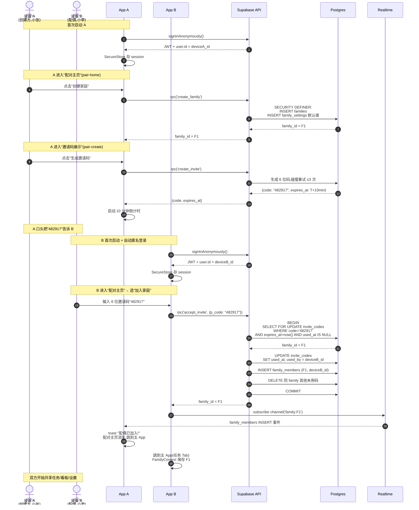
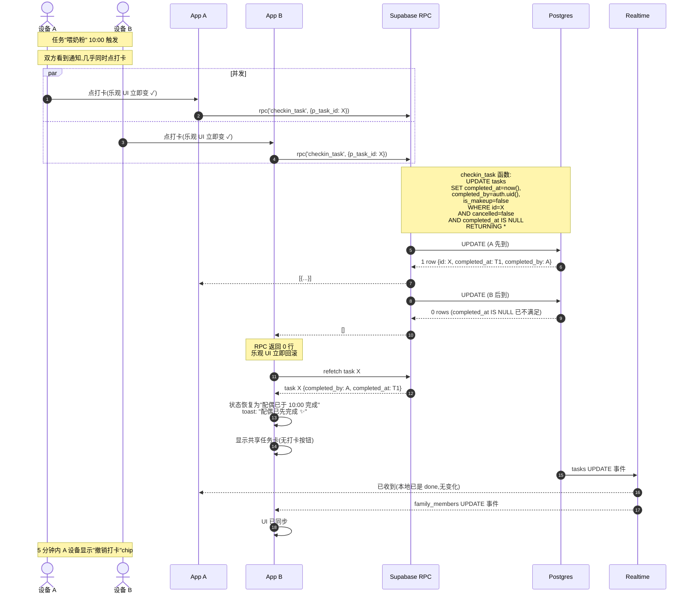
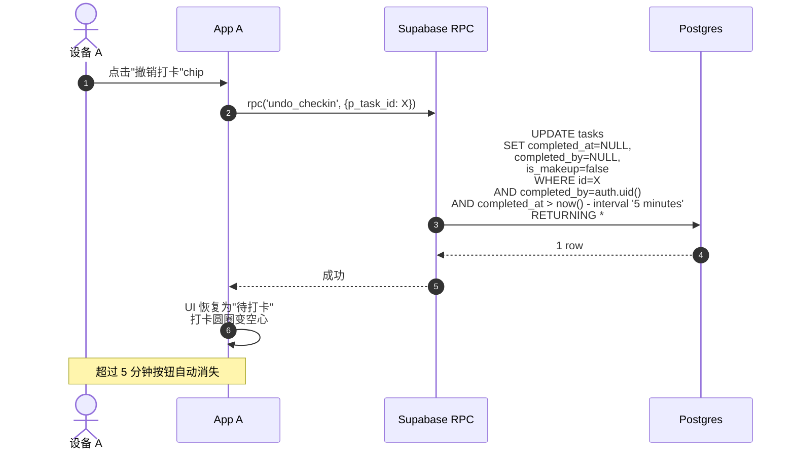
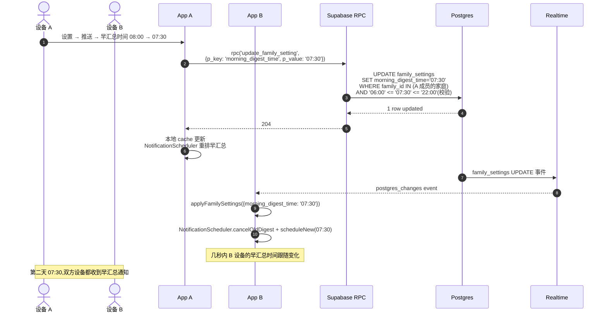
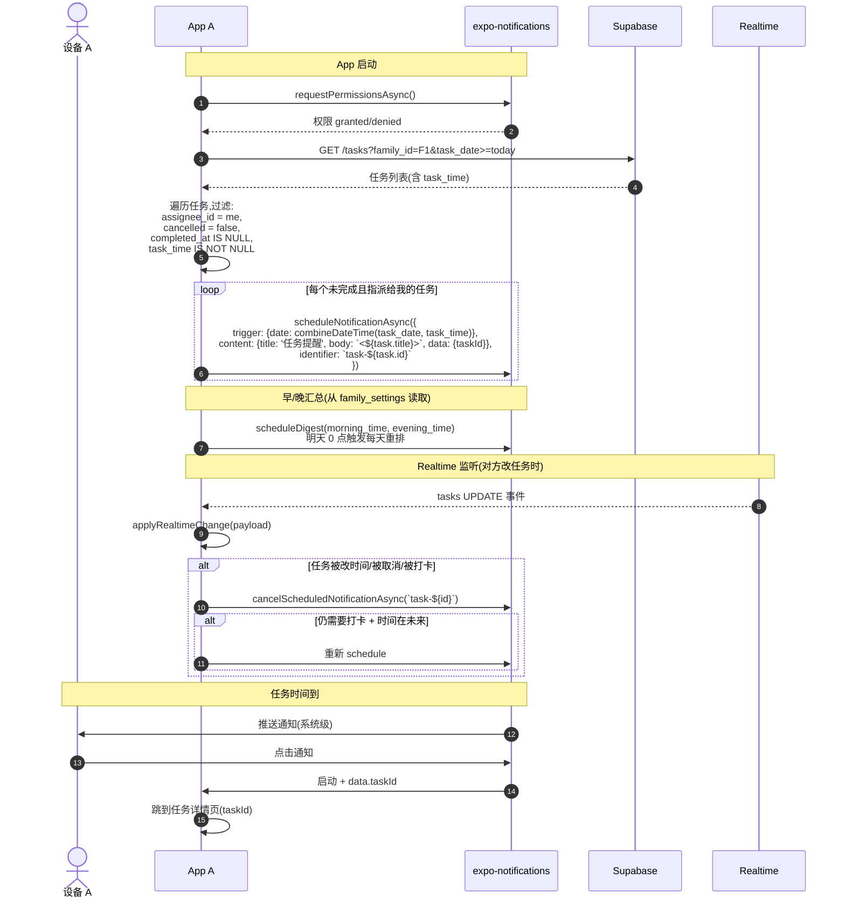
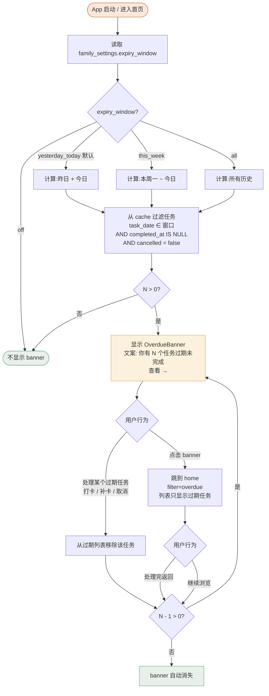

# FamSchedule — 关键交互流程图 v1.0

> 5 个核心用户流的 Mermaid 时序图 + 状态图,基于 PRD v1.3 + arch-v1.0 + ADR-001~007

---

## 文档元信息

| 字段 | 值 |
|---|---| 
| 项目名称 | FamSchedule |
| 文档版本 | v1.0 |
| 创建日期 | 2026-09-10 |
| **状态** | **✅ Approved(初版基线)** |
| 作者 | UI/UX Designer Agent |
| 来源 | design-v1.0.md + arch-v1.0.md + ADR-002/004/005/006/007 |

---

## ChangeLog

| 版本 | 日期 | 作者 | 变更摘要 |
|---|---|---|---|
| v1.0 | 2026-09-10 | UI/UX Designer | 初版;5 个核心流程图 |

---

## 进度概览

| 状态 | 数量 | 流程清单 |
|---|---|---|
| ✅ Done | 5 | 邀请配对、打卡并发、设置同步、推送调度、过期 banner |
| **合计** | **5** | — |

---

## 流程 1:邀请配对(US-012)

> 创建方 A 生成 6 位邀请码 → 配偶 B 在 10 分钟内输入 → 双方配对为同一 family

### 边缘场景 & 错误路径

| 场景 | UI 表现 | 后端处理 |
|---|---|---|
| 邀请码不存在 | 输入框下方红字"邀请码无效,请检查" | `RAISE EXCEPTION 'invalid_or_expired_code'` |
| 邀请码过期(> 10 分钟) | 同样提示"邀请码已过期,请向配偶索取新码" + 引导 A 重新生成 | `RAISE EXCEPTION 'invalid_or_expired_code'` |
| 邀请码已用(被其他设备用过) | "邀请码已被使用,请重新生成" | DB 行锁,SELECT FOR UPDATE 看到 used_at NOT NULL,返回 0 行 |
| 同一家庭已满 2 人 | "这个家庭已经有 2 个成员了" | `enforce_family_member_cap` trigger 阻止 INSERT |
| 同一设备已是某家庭成员,又尝试创建 | 创建按钮 disabled + 文案"你已在某家庭中" | RLS 隐式 |
| 网络断时尝试加入 | 顶部红色 banner "网络异常" + 按钮变 loading | 客户端写队列(reconnect 后 replay) |
| 倒计时到 0 邀请码自动失效 | 倒计时变 "已过期",按钮变 "重新生成" | UI 行为;后端继续按 expires_at 校验 |

---

## 流程 2:打卡并发(US-005,first-finisher wins)

> 任务 X 时间到,A 和 B 同时按"打卡",SQL 原子操作,先到者赢

### 撤销打卡(5 分钟内)

### 边缘场景

| 场景 | UI 表现 | 后端处理 |
|---|---|---|
| A 已完成,B 5 秒后才看到 | 0 行返回 → refetch → UI 提示"配偶已先完成" | 原子 UPDATE 已 nil 化 |
| A 5 分钟后想撤销 | "撤销打卡" chip 已消失,无法撤销 | SQL `completed_at > now() - 5min` 过滤 |
| 双方同时打卡(同 ms) | 仍 first-write-wins,后到者收到 0 行 | Postgres 行锁 + UPDATE 原子 |
| 离线时打卡 | 顶部离线 banner + 任务标"待同步"小图标 | 写 AsyncStorage 队列,reconnect 后 replay |
| 任务已过期 | 仍可打卡;打卡后过期 banner 自动消失(若此任务是 banner 中的一员) | `cancelled=false` 仍满足 |
| 任务已取消 | 打卡按钮 disabled + 文案"已取消" | `cancelled=true` 阻止 |

---

## 流程 3:设置变更 Realtime 同步(US-017 + ADR-007)

> 家庭任一成员改早/晚汇总时间,另一台设备几秒内自动同步并重排本地通知

### 边缘场景

| 场景 | UI 表现 | 后端处理 |
|---|---|---|
| 设置时间超出 06:00-22:00 范围 | 输入 chip 灰显 + 提示"时段范围 06:00 - 22:00" | RPC RAISE EXCEPTION 'time_out_of_range' |
| 离线时改设置 | 顶部离线 banner + 设置项标"待同步" | 写队列 + LWW,reconnect 后 replay |
| A 改 07:30,B 同时在改 08:00 | 后到者覆盖,符合 LWW(ADR-005) | last-write-wins by `updated_at` |
| B 设备正在使用 app,新值到达 | 实时刷新当前页面(若是设置页);若是首页,后台应用新值不影响当前 | 增量 cache update |
| 白名单状态(设备本地) | 不会跨设备同步 | raw_user_meta_data 各设备独立 |

---

## 流程 4:推送调度(US-007 + US-008 + ADR-006)

> 客户端本地排程,expo-notifications;到点触发;完成/取消时清除

### 边缘场景

| 场景 | UI 表现 | 处理 |
|---|---|---|
| ROM 杀进程,到点不响 | 用户错过提醒;下次启动重排时仍会包含未完成的任务 | US-016 引导加白名单;MVP 不做"漏响拉取" |
| 用户禁用通知权限 | 推送永远不会响;早/晚汇总同样不响 | 启动时检测;若禁用,在设置 → 推送 显示"通知权限已关闭" |
| 任务被补卡 | 客户端拉新数据,NotificationScheduler 取消该任务未来通知 | `completed_at IS NOT NULL` 过滤 |
| 任务过期 | 任务进入"已过期"列表;**不会**再触发提醒(已过时间) | `combineDateTime(date, time) < now()` 过滤 |
| 修改任务时间 | Realtime 收到 UPDATE,取消旧 schedule,排新 schedule | 增量 reconcile |
| 修改早/晚汇总时间 | 流程 3 同步 | NotificationScheduler.cancelOldDigest + scheduleNew |
| 任务被指派给配偶 | 本设备**不**排该任务的本地通知(仅配偶设备会排) | `assignee_id = me` 过滤 |
| 时区切换(出国) | 设备本地时区变化,任务时间按新时区计算,可能错过或错响 | MVP 接受;ADR-006-Q1 |

---

## 流程 5:启动过期任务 banner(US-015)

> App 启动时,根据 `expiry_window` 设置计算过期任务,显示 banner

### 边缘场景

| 场景 | UI 表现 | 处理 |
|---|---|---|
| 离线启动 | banner 仍显示(cache 中的数据);无网络更新 | cache last-known 兜底 |
| 设置改为 off | 下次启动 banner 不显示 | 重新计算 |
| 设置改为 all | banner 显示**所有**历史过期(可能很多) | 列表分页或"加载更多" |
| 过期任务被另一个家庭成员完成 | Realtime 同步,banner 立即更新 | 增量 reconcile |
| 过期任务周期(每周一)今天应该发生但昨天错过了 | banner 显示 | task_date < today AND not completed |
| 补卡已截止(late_checkin_cutoff=off) | banner 仍显示,但点击进去后任务无"补卡"按钮 | UI 禁用补卡入口 |

---

## 流程覆盖度自检

| PRD 故事 | 流程编号 | 备注 |
|---|---|---|
| US-012 创建/加入家庭 | 流程 1 | ✅ |
| US-005 一键打卡 | 流程 2 | ✅ |
| US-017 集中设置 | 流程 3 | 部分(推送时间同步),其他设置项(过期窗口/补卡截止)同理 |
| US-007 到点推送 | 流程 4 | ✅ |
| US-008 早/晚汇总 | 流程 4 | ✅ |
| US-015 启动过期 banner | 流程 5 | ✅ |
| US-013 匿名身份 | 流程 1 子步骤 | 隐含 |
| US-016 白名单引导 | (不在此 5 流程中,在 settings spec 中) | 单独交互 |
| US-001/002/003/004 | 任务 CRUD | 在 task-create/detail spec 中(非核心流程) |
| US-006 补卡 | 流程 2 类似 | SQL 截止校验相同机制 |
| US-009/010 共享 | 在 task-create/detail spec | 简化为表单字段 |
| US-011 看板 | 在 family-dashboard spec | 简化为展示组件 |
| US-014 过期任务标记 | 流程 5 + TaskStatusBadge | 横切 |

**所有 P0 故事均被覆盖。**
